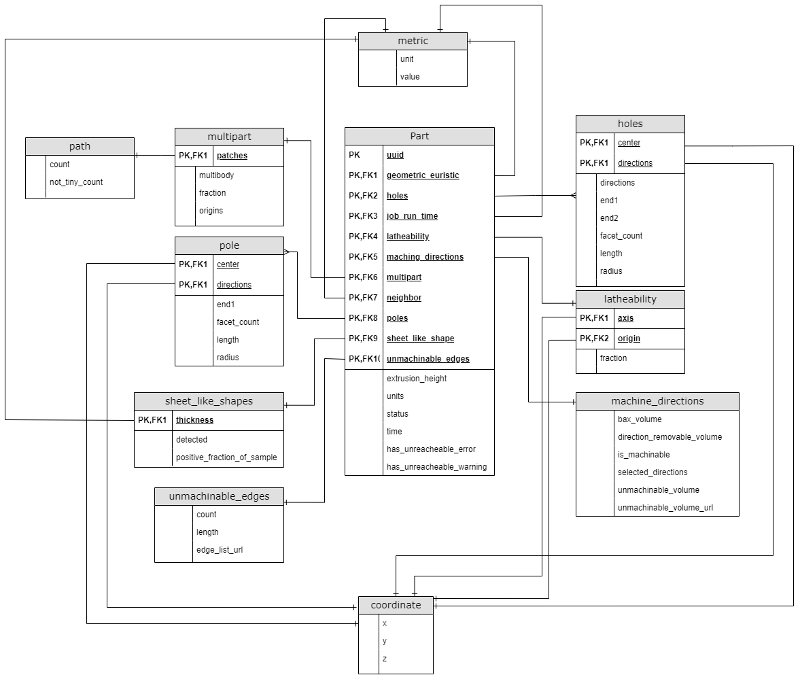
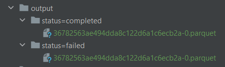

# Hubs challenge

To execute:
`python main.py`

Dependencies:

- Pandas 1.5.3
- Pyarrow 11.0
- Fastparquet 2023.2.0

## Entity Relationship Diagram
To represent the data in the diagram, the objects present in the flat data model became entities, which are used to extract information from the part, which will help later on to bring out insights about the data. Columns including their own set of attributes in general ended up being its own entity in the model, where primary keys and foreigh keys are created as ids using any hash method. 

## Results
#### Tech stack and strategies 

**Storage & Performance**: The data handled in parquet file works great for space optimization purposes. Nonetheless, we can optimize further depending on the most probable queries used by Hubs application, or even business areas within Hubs (Data Science area for example). **Partitioning** for example - it allows quicker access to the data, as any ETL won't have to scan the entire dataset if it's not needed. The load part of the ETL (write method) was built assuming that the qualitative parameter most used to query parts data is status column. Depending on whether the frequency of incoming data for parts is great in volume each day one might consider to partition by created dates, if geographically the data is well distributed even by country, or similar parameters.

**Data transformation**: Pandas is a good choice for transforming data, but arguably Spark does a better job at improving processing overall performance, with its lazy load. The choice was Pandas assuming data volumes are not going into big data grounds.  

### Assumptions
 - The qualitative parameter most used to query parts data is status column, and the respective data volumes for status categories are balanced.
 - Data volume is manageable. 

### Data insights
From 20k parts present in the dataset, roughly half (10k) have holes, from which 32% have warnings, and 4% have errors. This accounts for 2% and 0,2% of the total parts.   